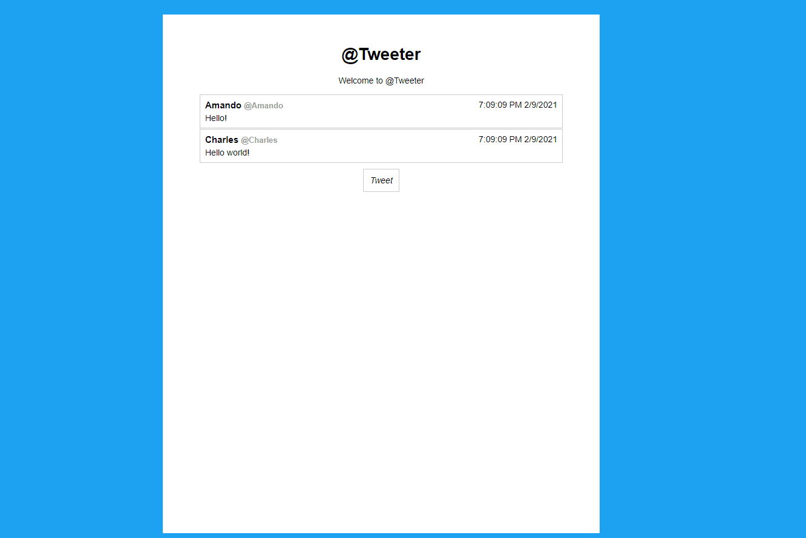

# mini-message-board

@Tweeter is a simple online message board to practice using the Node.js Express Framework.

Features:

    -Post your most political beliefs for your relatives to read!
    -Records date, username, and message.

Demonstrated Skills:

    -Uses the Express Framework for NodeJS to handle routing and server requests.
    -Uses pug template generator for all html.
    -Handles routes with express and directs to a separate web page to enter messages.
    -Handles errors.

Future Ways to Improve:

    -Make the messages be uploaded to a cloud based database like MongdDB.

Overall project time: ~8 hours
Date Completed: 2/09/2021

-Gary Arzumanyan

